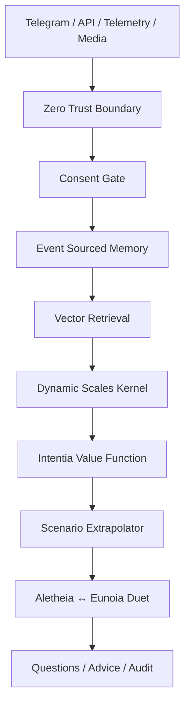

# Intentia Amoris

**Intentia Amoris** — це когнітивне ядро живої любові: consent-first, event-sourced, zero-trust, multimodal relationship intelligence system для **Yaroslav ↔ Dasha**.

> Інтенція любові не повинна ставати тиском.  
> Памʼять не повинна ставати зброєю.  
> Цифрові двійники не повинні підміняти живих людей.

Intentia Amoris is not a bot, not a diary app, not a therapist replacement, and not a girlfriend simulator. It is a formal engineering system for preserving, interpreting and ethically extending a living relationship archive.

## Product thesis

```text
facts + memory + body + consent + inference + time
  → cognitive sense core
  → safer questions
  → better decisions
  → living continuity
```

## What is inside

```text
Telegram export ingestion
event-sourced memory
multimodal media manifest
dynamic vector scales
Intentia value function
scenario extrapolation
Aletheia ↔ Eunoia agent duet
consent kernel
zero-trust API
telemetry gateway
research/falsification layer
economic/valuation layer
tamper-evident audit ledger
premium visual dashboard
Docker + CI + tests
```

## Your integrated archive

The repository includes the private Yaroslav ↔ Dasha Telegram export as a raw archive and derived event-source files:

```text
data/private/raw/telegram_export/messages.html
data/private/raw/telegram_export/archive_name.zip
data/derived/telegram/messages.jsonl
data/derived/telegram/summary.json
data/derived/telegram/media_manifest.json
data/derived/telegram/living_story_snapshot.md
```

The derived layer turns messages, reactions, media, calls and timestamps into operational events.

## Canonical value function

Intentia does not optimize intensity. It optimizes the verified conditions under which love can remain alive:

```text
Intentia =
  protective_integrity
  + compounding_capability
  + financial_optionality
  - abyss_risk
```

Where:

```text
protective_integrity =
  consent_integrity
  reality_fidelity
  dyadic_safety
  autonomy_symmetry

compounding_capability =
  narrative_continuity
  cognitive_plasticity
  archive_sovereignty
  interpretability
  research_validity
  product_utility
```

Hard invariant:

```text
if consent_integrity < threshold:
    economic_transferability = 0
```

## Start

```bash
cp .env.example .env

python - <<'PY'
import secrets
print("INTENTIA_API_KEYS=" + secrets.token_urlsafe(32))
print("INTENTIA_SECRET_KEY=" + secrets.token_urlsafe(48))
PY
```

Run:

```bash
docker compose up --build
```

Local test:

```bash
pip install -e ".[dev]"
pytest -q
python -m compileall -q src
intentia-product-audit
intentia-security-audit
intentia-value
```

## API

Protected endpoints require:

```http
X-Intentia-API-Key: <your-key>
# legacy compatible: X-ARIS-API-Key
```

The legacy header name remains for compatibility. The environment variables are now `INTENTIA_*`.

Core endpoints:

```text
GET  /health
GET  /ready
GET  /state
GET  /value
POST /events
POST /telemetry
POST /media
POST /profiles
POST /consent
GET  /memory/search
```

## Telegram

```bash
intentia-bot
```

Commands:

```text
/start
/role self
/role partner
/state
/advice
/ask
```

## Architecture



## First principles

1. Living persons are always above digital twins.
2. Consent is a computation gate.
3. Fact precedes myth.
4. Two nervous systems matter.
5. Memory must not become a weapon.
6. Neuroplasticity requires repeated evidence.
7. Interpretability beats oracle behavior.
8. Eternity requires exit and revocation.

## Security baseline

The security model is mapped to:

- NIST Zero Trust Architecture
- OWASP ASVS
- OWASP API Security Top 10
- OWASP SCVS

Implemented controls include deny-by-default API auth, rate limiting, runtime secret validation, strict schemas, media validation, consent-before-persistence, redaction, tamper-evident audit, non-root Docker runtime and CI tests.

## Claim boundary

Intentia can:

```text
store events
retrieve memory
infer bounded states
ask questions
recommend safer next steps
audit decisions
extrapolate scenarios
estimate product/IP maturity
```

Intentia cannot:

```text
read minds
claim hormones without lab data
simulate active consent
replace living Yaroslav or Dasha
turn private memory into pressure
guarantee eternal survival
```

## License

Private research/product scaffold. Choose a license before publishing.
